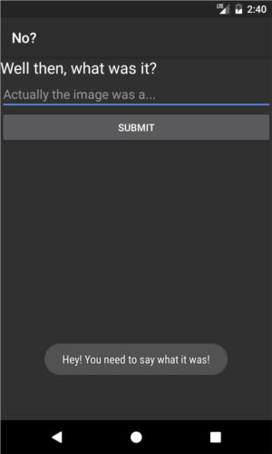
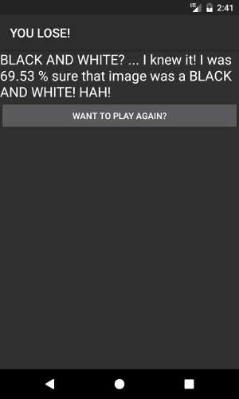

# PA3-VISION "BEAT GOOGLE VISION"
This application is a simple game for testing out the Google Vision Api. It is very simple. Basically it will let you capture an image with your devices camera and the app sends that to google's cloud testing for labels, and then tries to guess the name of an item/thing featured in that image. The application is formated into a sort of guessing game with branching screens. The purpose, aside from meeting the homework requirement, is to test the abilities of the api quickly.

## System Design 
This app requires use of the device's camera, internet and both reading and writing to external storage. It was tested on an Android 7.0 tablet and on Android 7.1 emulation. It's built to have a minimum requirement of Android 5.0 but this is untested. After taking the image the app might hang a bit as it loads, resizes and sends the image to the cloud and waits for results.

## Usage
Usage of this app is simple. Upon opening, you are greeted to the initial screen with a single button to open your camera (as seen below-left).

 

After taking and selecting the image from the device's camera app you are taken to the second screen where the app will try to guess the content of the image (above-right). Selecting 'yes' here will send you to the success screen where the app will gloat about winning (as seen below-left). The "success" screen has a button that will return to the initial screen. Selecting 'no' at the guess will send you to the input screen (pictured below-right) In which the app asks what the content is. Here you must input text to continue.

 

Hitting submit after entering something has two possible outcomes. Either the thing you entered was in the label detection results and the last screen will say you lost, or it was not in the results and you will have won. Both will again feature a button to return to the initial page.

 

That's basically all there is to it. Also to note you should be able to use the navigate back button to safely go back a screen if you need to. -should- . Lastly try to get your target in the center of the frame because for whatever reason the app seems to rotate the image and it -may- be chopping off the top and bottom of the image.
